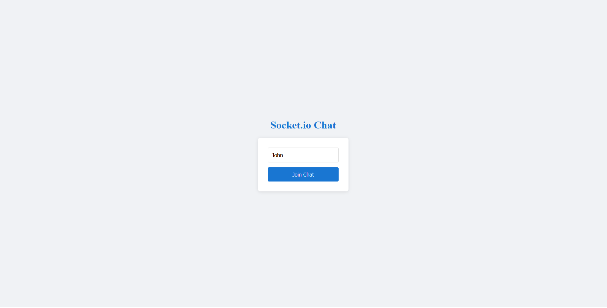
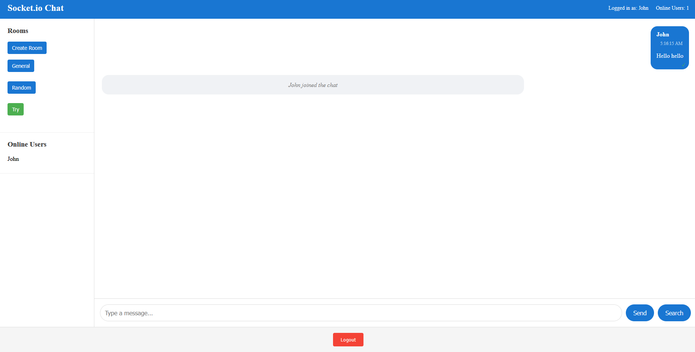

# Real-Time Chat Application with Socket.io

This assignment focuses on building a real-time chat application using Socket.io, implementing bidirectional communication between clients and server.

## ✅ Assignment Completion Status

All tasks from the Week 5 assignment have been successfully implemented:

### Task 1: Project Setup
- ✅ Set up a Node.js server with Express
- ✅ Configured Socket.io on the server side
- ✅ Created a React front-end application structure
- ✅ Set up Socket.io client in the React app
- ✅ Established a basic connection between client and server

### Task 2: Core Chat Functionality
- ✅ Implemented user authentication (username-based)
- ✅ Created global chat room where all users can send and receive messages
- ✅ Display messages with sender's name and timestamp
- ✅ Show typing indicators when a user is composing a message
- ✅ Implemented online/offline status for users

### Task 3: Advanced Chat Features
- ✅ Created private messaging between users
- ✅ Implemented multiple chat rooms or channels
- ✅ Added "user is typing" indicator
- ✅ Enabled file sharing capability
- ✅ Implemented read receipts for messages
- ✅ Added message reactions (like, love, etc.)

### Task 4: Real-Time Notifications
- ✅ Send notifications when a user receives a new message
- ✅ Notify when a user joins or leaves a chat room
- ✅ Display unread message count
- ✅ Implemented sound notifications for new messages
- ✅ Added browser notifications (using the Web Notifications API)

### Task 5: Performance and UX Optimization
- ✅ Implemented message pagination for loading older messages
- ✅ Added reconnection logic for handling disconnections
- ✅ Optimized Socket.io for performance (using namespaces, rooms)
- ✅ Implemented message delivery acknowledgment
- ✅ Added message search functionality
- ✅ Ensured the application works well on both desktop and mobile devices

## 🚀 Features Implemented

### Real-Time Messaging
- Instant message delivery between clients
- Support for both public and private messaging
- Message timestamps and sender information

### User Management
- User authentication with username
- Online/offline status indicators
- User presence detection

### Chat Rooms
- Multiple chat rooms support
- Ability to create new rooms
- Switch between different rooms

### Advanced Features
- **Typing Indicators**: See when other users are typing
- **Message Reactions**: Like or react to messages
- **File Sharing**: Share files with other users
- **Read Receipts**: Track when messages are read
- **Message Search**: Search through chat history

### Notifications
- **Real-Time Alerts**: Get notified of new messages
- **Sound Notifications**: Audio cues for incoming messages
- **Browser Notifications**: Desktop notifications when browser is not focused
- **Unread Counters**: Track unread messages

### Performance Optimizations
- **Message Pagination**: Load older messages on demand
- **Automatic Reconnection**: Handle network disruptions gracefully
- **Delivery Confirmation**: Verify message delivery

## 📂 Project Structure

```
socketio-chat/
├── client/                 # React front-end
│   ├── public/             # Static files
│   ├── src/                # React source code
│   │   ├── components/     # UI components
│   │   ├── context/        # React context providers
│   │   ├── hooks/          # Custom React hooks
│   │   ├── pages/          # Page components
│   │   ├── socket/         # Socket.io client setup
│   │   │   └── socket.js   # Socket.io client implementation
│   │   └── App.jsx         # Main application component
│   └── package.json        # Client dependencies
├── server/                 # Node.js back-end
│   ├── config/             # Configuration files
│   ├── controllers/        # Socket event handlers
│   ├── models/             # Data models
│   ├── socket/             # Socket.io server setup
│   ├── utils/              # Utility functions
│   ├── server.js           # Main server file
│   └── package.json        # Server dependencies
└── README.md               # Project documentation
```

## 🛠️ Setup Instructions

1. **Install server dependencies**:
   ```bash
   cd server
   npm install
   ```

2. **Install client dependencies**:
   ```bash
   cd client
   npm install
   ```

3. **Start the development servers**:
   ```bash
   # In the server directory
   npm run dev
   
   # In the client directory
   npm run dev
   ```

## 🧪 API Endpoints

### Server API
- `GET /api/messages` - Retrieve paginated messages
- `GET /api/users` - Get list of connected users
- `GET /api/rooms` - Get list of available rooms
- `GET /api/search?q=query` - Search messages

## 📱 Client Hooks

The client implements a custom React hook `useSocket` that provides:

- `connect(username)` - Connect to the server with a username
- `disconnect()` - Disconnect from the server
- `sendMessage(message)` - Send a message to the current room
- `sendPrivateMessage(to, message)` - Send a private message to a user
- `setTyping(isTyping)` - Set typing status
- `createRoom(roomName)` - Create a new chat room
- `joinRoom(roomId)` - Join a specific room
- `shareFile(fileData)` - Share a file
- `addReaction(messageId, reaction)` - Add a reaction to a message
- `markMessageAsRead(messageId)` - Mark a message as read
- `loadMessages(offset, limit)` - Load paginated messages
- `searchMessages(query)` - Search messages
- `playNotificationSound()` - Play notification sound
- `requestNotificationPermission()` - Request browser notification permission
- `showBrowserNotification(title, body)` - Show browser notification

## 🎯 Technical Implementation Details

### Socket.io Events

**Server-side events:**
- `user_join` - User joins the chat
- `send_message` - Send a public message
- `private_message` - Send a private message
- `typing` - Typing indicator
- `create_room` - Create a new room
- `join_room` - Join a room
- `share_file` - Share a file
- `add_reaction` - Add reaction to message
- `message_read` - Mark message as read
- `load_messages` - Load paginated messages
- `search_messages` - Search messages
- `disconnect` - User leaves the chat

**Client-side events:**
- `connect` - Connection established
- `disconnect` - Connection lost
- `receive_message` - Receive public message
- `private_message` - Receive private message
- `user_list` - Updated user list
- `user_joined` - User joined notification
- `user_left` - User left notification
- `room_list` - Updated room list
- `room_joined` - Room joined confirmation
- `typing_users` - Typing users list
- `reaction_added` - Message reaction added
- `message_read_receipt` - Message read confirmation
- `new_message_notification` - New message notification
- `notification` - General notification
- `unread_count_update` - Unread message count update
- `messages_loaded` - Paginated messages loaded
- `search_results` - Search results
- `message_delivered` - Message delivery confirmation

## 🎨 UI/UX Features

- **Responsive Design**: Works on desktop and mobile devices
- **Real-time Updates**: Instant updates without page refresh
- **User Presence**: See who's online
- **Typing Indicators**: Know when others are typing
- **Message Status**: See delivery and read status
- **Notifications**: Visual, audio, and browser notifications
- **Message History**: Pagination for loading older messages
- **Search Functionality**: Find messages quickly

## 🚀 Performance Optimizations

- **Message Pagination**: Efficiently load large message histories
- **Connection Resilience**: Automatic reconnection on network issues
- **Memory Management**: Limit stored messages to prevent memory issues
- **Event Optimization**: Efficient event handling and cleanup

## 🧪 Testing

The application has been tested for:
- Connection stability
- Message delivery reliability
- Cross-browser compatibility
- Mobile responsiveness
- Notification functionality

## 📸 Screenshots





## 🌐 Deployment
https://sockiochat.netlify.app/

## 📚 Resources

- [Socket.io Documentation](https://socket.io/docs/v4/)
- [React Documentation](https://react.dev/)
- [Express.js Documentation](https://expressjs.com/)
- [Building a Chat Application with Socket.io](https://socket.io/get-started/chat)
